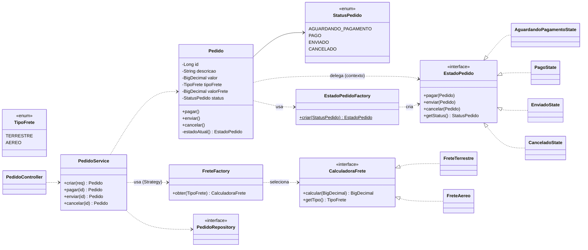

# E-commerce de Pedidos — Padrões State e Strategy

Projeto Spring Boot (Java 17) que controla os pedidos de um e-commerce, com:

- **Padrão State** → controle do status do pedido (Aguardando Pagamento → Pago → Enviado / Cancelado).
- **Padrão Strategy** → cálculo do frete na criação do pedido (Terrestre 5%, Aéreo 10%, extensível).
- Persistência em banco de dados (JPA + H2).
- APIs REST documentadas e testáveis via **Swagger** ou **Postman**.

---

## Como executar (IntelliJ)

1. Abra a pasta do projeto no IntelliJ IDEA → **File > Open** e selecione o `pom.xml` (importar como projeto Maven).
2. Aguarde o IntelliJ baixar as dependências.
3. Rode a classe `PedidosApplication` (botão ▶ ao lado do `main`).

Ou pela linha de comando:

```bash
mvn spring-boot:run
```

A aplicação sobe em `http://localhost:8080`.

### Endereços úteis
- **Swagger UI:** http://localhost:8080/swagger-ui.html
- **OpenAPI JSON:** http://localhost:8080/v3/api-docs
- **Console H2 (banco):** http://localhost:8080/h2-console
  - JDBC URL: `jdbc:h2:mem:pedidosdb` · user: `sa` · senha: (vazio)

---

## APIs REST do projeto (endpoints)

Todos os endpoints estão sob o prefixo `/api/pedidos` e usam JSON. Resumo:

| # | Método | Rota                          | O que faz                                      | Respostas |
|---|--------|-------------------------------|------------------------------------------------|-----------|
| 1 | POST   | `/api/pedidos`                | Cria o pedido e calcula o frete (Strategy)     | 201, 400  |
| 2 | GET    | `/api/pedidos`                | Lista todos os pedidos                         | 200       |
| 3 | GET    | `/api/pedidos/{id}`           | Busca um pedido pelo id                        | 200, 404  |
| 4 | POST   | `/api/pedidos/{id}/pagar`     | Paga o pedido (State: AG. PAG. → PAGO)         | 200, 404, 409 |
| 5 | POST   | `/api/pedidos/{id}/enviar`    | Envia o pedido (State: PAGO → ENVIADO)         | 200, 404, 409 |
| 6 | POST   | `/api/pedidos/{id}/cancelar`  | Cancela o pedido (State: AG. PAG./PAGO → CANCELADO) | 200, 404, 409 |

A seguir, o detalhe de cada API.

### 1. `POST /api/pedidos` — Criar pedido
Cria um novo pedido, **já calculando o valor do frete** com base no tipo de envio escolhido
(é aqui que o padrão **Strategy** atua). O pedido nasce no estado `AGUARDANDO_PAGAMENTO`
e é persistido no banco de dados.

- **Corpo (request):**
```json
{
  "descricao": "Notebook Gamer",
  "valor": 100.00,
  "tipoFrete": "TERRESTRE"
}
```
- **Campos:** `descricao` (texto, obrigatório), `valor` (> 0, obrigatório),
  `tipoFrete` (`TERRESTRE` = 5% ou `AEREO` = 10%, obrigatório).
- **Resposta `201 Created`:**
```json
{
  "id": 1,
  "descricao": "Notebook Gamer",
  "valor": 100.00,
  "tipoFrete": "TERRESTRE",
  "valorFrete": 5.00,
  "status": "AGUARDANDO_PAGAMENTO",
  "criadoEm": "2026-05-30T10:00:00"
}
```
- **Erros:** `400 Bad Request` se os dados forem inválidos (descrição vazia, valor ≤ 0, tipo de frete ausente).
- Use `"tipoFrete": "AEREO"` para frete de 10% (ex.: valor 200 → frete 20,00).

### 2. `GET /api/pedidos` — Listar pedidos
Retorna **todos os pedidos** cadastrados no banco. Útil para conferir o estado atual de cada um.
- **Resposta `200 OK`:** uma lista (array) de pedidos no mesmo formato da resposta acima.

### 3. `GET /api/pedidos/{id}` — Buscar pedido por id
Retorna **um único pedido** pelo seu identificador.
- **Parâmetro de URL:** `id` do pedido.
- **Resposta `200 OK`:** o pedido encontrado.
- **Erro:** `404 Not Found` se o id não existir.

### 4. `POST /api/pedidos/{id}/pagar` — Pagar pedido
Aciona a transição de estado **AGUARDANDO_PAGAMENTO → PAGO** (padrão **State**). Não tem corpo.
- **Resposta `200 OK`:** o pedido com `status: "PAGO"`.
- **Erros:** `404` se não existir; `409 Conflict` se a transição for inválida
  (ex.: pedido já pago — não pode pagar de novo; ou já enviado/cancelado).

### 5. `POST /api/pedidos/{id}/enviar` — Enviar pedido
Aciona a transição **PAGO → ENVIADO** (padrão **State**). Exige que o pedido esteja pago. Não tem corpo.
- **Resposta `200 OK`:** o pedido com `status: "ENVIADO"`.
- **Erros:** `404` se não existir; `409 Conflict` se ainda não estiver pago
  (ex.: aguardando pagamento) ou já estiver enviado/cancelado.

### 6. `POST /api/pedidos/{id}/cancelar` — Cancelar pedido
Aciona a transição **AGUARDANDO_PAGAMENTO ou PAGO → CANCELADO** (padrão **State**). Não tem corpo.
- **Resposta `200 OK`:** o pedido com `status: "CANCELADO"`.
- **Erros:** `404` se não existir; `409 Conflict` se já estiver enviado ou já cancelado
  (estados finais não mudam mais).

> **Códigos de status usados:** `200` sucesso · `201` criado · `400` dados inválidos ·
> `404` pedido não encontrado · `409` transição de estado inválida. Os erros retornam um JSON
> com `timestamp`, `status`, `erro` e `mensagem` explicativa (ver `GlobalExceptionHandler`).

---

## APIs / tecnologias (bibliotecas) utilizadas

O projeto é construído sobre o ecossistema **Spring Boot 3.2.5 (Java 17)**. Cada dependência
(API/biblioteca) declarada no `pom.xml` cumpre um papel específico:

| Biblioteca (API) | Para que serve no projeto |
|------------------|---------------------------|
| **Spring Web (spring-boot-starter-web)** | Expõe a API REST (anotações `@RestController`, `@PostMapping`, `@GetMapping`) e o servidor web embutido **Tomcat**. É o que recebe as requisições HTTP e devolve JSON. |
| **Spring Data JPA (spring-boot-starter-data-jpa)** | Faz a **persistência no banco de dados**. Com a interface `PedidoRepository extends JpaRepository`, ganhamos `save`, `findById`, `findAll` etc. sem escrever SQL. O Hibernate é o provedor JPA por baixo. |
| **H2 Database** | **Banco de dados** em memória usado para rodar/testar rapidamente, sem instalar nada. Acessível pelo console web em `/h2-console`. Pode ser trocado por MySQL/PostgreSQL alterando o `application.properties`. |
| **Bean Validation (spring-boot-starter-validation)** | **Valida os dados de entrada** com anotações no DTO (`@NotBlank`, `@NotNull`, `@DecimalMin`). Entrada inválida vira `400 Bad Request` automaticamente. |
| **springdoc-openapi (swagger-ui)** | Gera a **documentação interativa (Swagger UI)** a partir do código e permite **testar os endpoints pelo navegador** em `/swagger-ui.html`. Também publica o contrato OpenAPI em `/v3/api-docs`. |
| **spring-boot-starter-test (JUnit 5, MockMvc)** | **Testes automatizados**: testes de unidade (Strategy e State) e de integração da API (MockMvc), garantindo que tudo funcione. |

Endereços expostos por essas APIs em tempo de execução:
- **Swagger UI:** `http://localhost:8080/swagger-ui.html`
- **OpenAPI JSON:** `http://localhost:8080/v3/api-docs`
- **Console do banco H2:** `http://localhost:8080/h2-console`

---

## Regras de negócio (transições de estado)

```
                 pagar
AGUARDANDO_PAGAMENTO ───────────► PAGO
   │                                │
   │ cancelar                       │ enviar
   ▼                                ▼
CANCELADO  ◄───────────────────  ENVIADO
              cancelar (a partir de PAGO)
```

- O pedido nasce em **AGUARDANDO_PAGAMENTO**.
- **Pagar:** só é permitido em AGUARDANDO_PAGAMENTO → vai para PAGO. Pago não pode ser pago de novo.
- **Enviar:** só é permitido em PAGO → vai para ENVIADO.
- **Cancelar:** permitido em AGUARDANDO_PAGAMENTO ou PAGO → vai para CANCELADO.
- **ENVIADO** e **CANCELADO** são estados finais (não mudam mais).

Qualquer transição inválida retorna **HTTP 409 (Conflict)** com mensagem explicativa.

> Observação: o enunciado tem um trecho contraditório ("uma vez pago não pode mais ser cancelado"
> vs. "uma vez pago o pedido pode ser enviado ou ainda cancelado"). Foi adotada a regra do material
> da disciplina (aula de State), na qual um pedido **Pago pode ser cancelado**.

---

## Diagrama de classes



---

## Padrões de projeto utilizados — e por quê

### 1. State (Comportamental) — status do pedido

**Problema que resolve:** sem o padrão, a classe `Pedido` concentraria toda a lógica de transição
em grandes blocos de `if/switch` sobre o status (ex.: "se status == PAGO então pode enviar..."). Isso
cresce e fica difícil de manter a cada novo estado, exatamente o problema descrito na aula.

**Como foi aplicado:**
- A interface `EstadoPedido` declara uma operação para cada transição possível (`pagar`, `enviar`, `cancelar`).
- Cada estado concreto (`AguardandoPagamentoState`, `PagoState`, `EnviadoState`, `CanceladoState`)
  implementa o comportamento daquele estado: efetua a transição válida ou lança exceção quando inválida.
- A classe `Pedido` é o **contexto**: ela não decide nada por conta própria, apenas delega a ação ao
  estado atual (`estadoAtual().pagar(this)`).
- Como o status é persistido como `enum`, a `EstadoPedidoFactory` reconstrói o objeto de estado
  correspondente ao ler o pedido do banco.

**Benefícios obtidos:** transições explícitas e isoladas por classe; adicionar um novo estado
(ex.: "Em Separação") significa criar uma classe e registrá-la na fábrica, sem alterar os demais —
princípio aberto/fechado.

### 2. Strategy (Comportamental) — cálculo do frete

**Problema que resolve:** o cálculo do frete varia conforme o meio de envio e o sistema deve permitir
**agregar novas formas de envio**. Sem o padrão, o cálculo viraria um `switch` por tipo de frete.

**Como foi aplicado:**
- A interface `CalculadoraFrete` define o algoritmo (`calcular`).
- `FreteTerrestre` (5%) e `FreteAereo` (10%) são as **estratégias concretas** intercambiáveis.
- `FreteFactory` recebe automaticamente do Spring todas as estratégias disponíveis e seleciona a
  correta em tempo de execução conforme o `TipoFrete` escolhido pelo cliente.
- O `PedidoService` (cliente/contexto) apenas pede o cálculo à estratégia, sem conhecer a fórmula.

**Benefícios obtidos:** para criar uma nova forma de envio (ex.: `FreteMaritimo`), basta uma nova
classe `@Component` que implementa `CalculadoraFrete` e um novo valor no enum `TipoFrete` —
nenhuma classe existente precisa ser modificada.

> Relação entre os padrões (citada nas aulas): o **State** pode ser visto como uma extensão do
> **Strategy** — ambos baseados em composição/delegação. A diferença é que no Strategy as estratégias
> são independentes entre si, enquanto no State os estados conhecem e definem as transições para os
> outros estados.

---

## Estrutura de pacotes

```
com.ecommerce.pedidos
├── PedidosApplication.java         # bootstrap Spring Boot
├── config/OpenApiConfig.java       # metadados Swagger
├── controller/PedidoController.java# API REST
├── dto/                            # objetos de entrada/saída
├── domain/
│   ├── Pedido.java                 # entidade JPA + contexto do State
│   ├── StatusPedido.java           # enum de status (persistido)
│   └── state/                      # >>> padrão State
│       ├── EstadoPedido.java
│       ├── AguardandoPagamentoState.java
│       ├── PagoState.java
│       ├── EnviadoState.java
│       ├── CanceladoState.java
│       └── EstadoPedidoFactory.java
├── frete/                          # >>> padrão Strategy
│   ├── CalculadoraFrete.java
│   ├── FreteTerrestre.java
│   ├── FreteAereo.java
│   ├── TipoFrete.java
│   └── FreteFactory.java
├── repository/PedidoRepository.java# persistência (JPA)
├── service/PedidoService.java      # regras de negócio
└── exception/                      # tratamento de erros
```

## Coleção Postman (rápida)

1. `POST http://localhost:8080/api/pedidos` com o JSON de exemplo acima.
2. `POST http://localhost:8080/api/pedidos/1/pagar`
3. `POST http://localhost:8080/api/pedidos/1/enviar`
4. Tente `POST .../1/cancelar` depois de enviado → retorna 409 (transição inválida).
